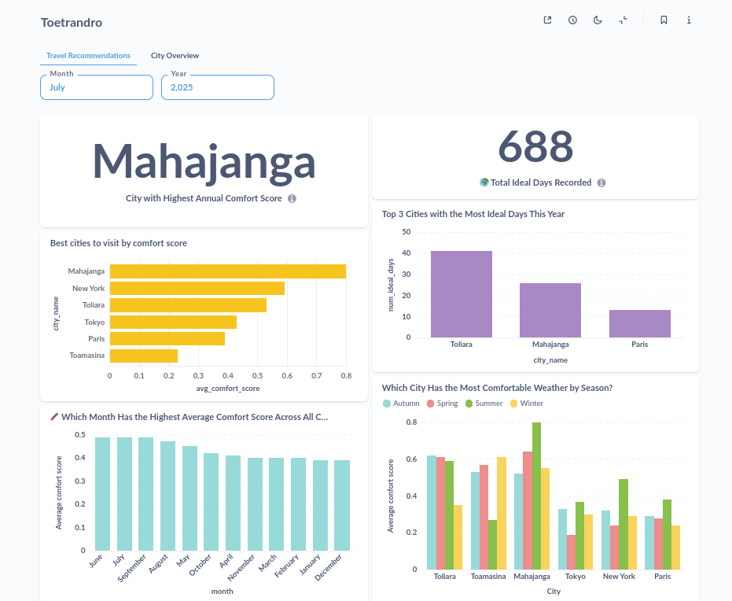
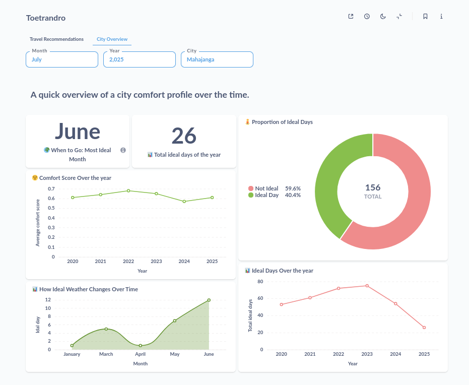

# 🌤️ Toetrandro-etl — Travel Recommendation Based on Climate

## 🧭 Project Overview

**Toetrandro-etl** is a full-stack ETL and analytics pipeline that collects, processes, and visualizes weather data to answer a real-world question:

> 🗺️ *When is the best time to visit a city based on weather conditions?*

This project combines automation, data modeling, and interactive dashboards to deliver actionable travel recommendations based on real-time and historical climate data.

---

## 🎯 Project Goals

- 📦 Automate daily ETL workflows using Apache Airflow  
- 🌍 Integrate real-time and historical weather data  
- 🧼 Clean and model data for climate-based travel scoring  
- 📊 Visualize insights through an interactive dashboard  

---

## 🌐 Use Case: Climate & Tourism

### ❓ Problem Statement

> Can we recommend the best times to visit a city based on weather comfort?

### 📈 Key Metrics

- ✅ Ideal temperature range (e.g., 22°C–28°C)  
- 🌧️ Low precipitation and wind speed  
- 📅 Monthly comfort scores and ideal day counts  

---

## ⚙️ Technical Stack

| Layer         | Tools/Technologies Used           |
|---------------|-----------------------------------|
| Automation    | Apache Airflow                    |
| Data Handling | Python, Pandas, GeoCoder          |
| Data Sources  | OpenWeather API, CSV/OpenMeteo    |
| Visualization | Jupyter Notebooks, Metabase       |
| Orchestration | DAGs with task-based architecture |

---

## 🛠️ Key Features

- 📡 **Daily automated extraction** of weather data  
- 📂 **Historical dataset integration** (CSV, APIs)  
- 🔄 **ETL pipeline** with modular Airflow tasks: `extract`, `transform`, `merge`, `migrate`  
- 🧽 **Data cleaning & normalization** for schema consistency  
- 🌟 **Star schema modeling** for analytics-ready structure  
- 📊 **Interactive dashboard** with filters by city, month, and metric  

---

## 📁 Repository Structure

```
toetrandro-etl/
├── workflows/
│   ├── dags/                   # Airflow DAGs
│   ├── scripts/                # Task logic
│   └── config/                 # Airflow variables/settings
├── data/
│   ├── raw/                    # Raw extracted data
│   ├── merged/                 # Final merged dataset
│   └── processed/              # Cleaned, transformed data
├── notebooks/                  # Jupyter Notebooks for EDA & modeling
├── src/
│   ├── api/                    # OpenWeather API client
│   ├── core/                   # ETL logic
│   └── utils/                  # Logging, helpers
├── tests/                      # Unit tests
├── requirements.txt            # Dependencies
└── README.md
```

---

## 🔁 Pipeline Logic (Airflow DAG)

1. **establish_city_config** – Defines cities and config  
2. **extract_weather_data** – Pulls real-time weather from OpenWeather API  
3. **transform_enriched_data** – Cleans and enriches the dataset  
4. **merge_processed_files** – Combines historical and real-time data  
5. **migrate_data_to_postgres** – Loads data into a star schema in PostgreSQL  

---

## 📚 Additional Documentation

Detailed documentation is available in the [`doc`](doc) folder:

- 🧱 [Pipeline Process](doc/process/process_doc.md) — Detailed breakdown of each ETL step  
- 🌬️ [Airflow Configuration](doc/process/airflow_env.md) — Airflow variables and environment setup  
- 📊 [Model Documentation](doc/data/model_doc.md) — About how the model is design (**Star schema model**)

---

## 📊 Dashboard Overview

The Toetrandro dashboard is designed to answer two complementary questions:

---

### 🌍 Global View: *Where and when is the best place to travel?*



This view provides a high-level comparison across all cities and time periods. It answers:

- 🏆 Which city has the highest annual comfort score?  
- 📅 How many ideal days were recorded across all cities?  
- 🌟 Which cities are best to visit overall?  
- 📆 Which months are most comfortable for travel?  
- ❄️ How does seasonal comfort vary by city?  

> This global perspective helps travelers compare destinations and choose the best months to travel based on aggregated climate comfort.

---

### 🏙️ Local View: *What’s the best time to visit a specific city?*



This city-specific dashboard allows users to select a city, month, and year to explore detailed comfort trends. It answers:

- 📌 What is the most ideal month to visit this city?  
- 📅 How many ideal days occurred in the selected year?  
- 📊 What proportion of days were ideal vs. not ideal?  
- 📈 How has the comfort score evolved over the years?  
- 🔄 How does the number of ideal days change month by month?  
- 🕰️ Is the city becoming more or less comfortable over time?  

> For example, selecting **Mahajanga** in **2025** reveals:  
> - ✅ June is the most ideal month  
> - 📅 26 ideal days recorded that year  
> - 📊 40.4% of days were ideal  
> - 📈 A steady increase in comfort score from 2020 to 2025  
> - 🔄 Monthly breakdown showing June peaking with 12 ideal days  

---

## 🧪 Testing & Reliability

- ✅ Unit tests for all ETL components  
- 🔁 Retry logic and logging in Airflow tasks  
- 🔐 Secure API key handling via Airflow Variables  

---

## 🚀 Getting Started

1. **Clone the repository**  
   ```bash
   git clone https://github.com/Abega1642/toetrandro-etl.git
   ```

2. **Install dependencies**  
   ```bash
   pip install -r requirements.txt
   ```

3. **Set environment variables**  
   Follow the instructions in [airflow_env.md](doc/process/airflow_env.md)

---

> ‼️ IMPORTANT NOTE : before you run the DAG, make sure you have the PostgreSQL database set up, with correct credentials, database and table. Details on the tables can be found in the file indicated below.
> Make sure to have the database correctly set-up !

Script name: [toetrandro_db_scipt.sql](../../migration/toetrandro_db_script.sql)

---

4. **Initialize Airflow**  
   ```bash
   airflow db init
   airflow users create --username admin ...
   ```

5. **Launch Airflow**  
   ```bash
   airflow scheduler &
   airflow api-server &
   airflow dag-processor
   ```

---

## 📌 Future Improvements

- 🌍 Add more cities and weather APIs  
- 🗺️ Enhance dashboard with maps and geospatial filters  
- 🐳 Dockerize the pipeline for easier deployment  

---

## 👥 Author

- **Abegà Razafindratelo**

---

## 📄 License

This project is licensed under the MIT License.
