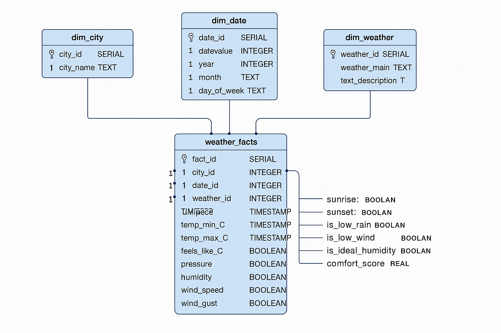

# 🌟 Star Schema Design — Toetrandro ETL

The final stage of the ETL pipeline loads the merged dataset into a PostgreSQL database using a **star schema**. This schema is optimized for analytical queries and powers the dashboard and reporting layer.

---

> ‼️ IMPORTANT NOTE : before you run the DAG, make sure you have the PostgreSQL database set up, with correct credentials, database and table. Details on the tables can be found in the file indicated below.
> Make sure to have the database correctly set-up !

Script name: [toetrandro_db_scipt.sql](../../migration/toetrandro_db_script.sql)

---

## 🧱 Schema Overview

At the center of the schema is the **`weather_facts`** table, which stores detailed weather observations. It is connected to three dimension tables:

- **`dim_city`** — city names  
- **`dim_date`** — calendar breakdown of each observation  
- **`dim_weather`** — descriptive weather conditions  

Each dimension table is linked to the fact table via a foreign key.

---

---

## 📊 Table Descriptions

### 🔹 `dim_city`

Stores unique city names.

| Column      | Type   | Description         |
|-------------|--------|---------------------|
| `city_id`   | SERIAL | Primary key         |
| `city_name` | TEXT   | Unique city name    |

---

### 🔹 `dim_date`

Stores calendar information derived from the observation timestamp.

| Column        | Type    | Description              |
|---------------|---------|--------------------------|
| `date_id`     | SERIAL  | Primary key              |
| `date_value`  | DATE    | Unique date              |
| `year`        | INTEGER | Year of observation      |
| `month`       | TEXT    | Month name               |
| `day_of_week` | TEXT    | Day of the week          |

---

### 🔹 `dim_weather`

Stores descriptive weather conditions.

| Column              | Type   | Description                     |
|---------------------|--------|---------------------------------|
| `weather_id`        | SERIAL | Primary key                     |
| `weather_main`      | TEXT   | General weather category        |
| `weather_description` | TEXT | Detailed weather description    |

---

### 🔸 `weather_facts` (Fact Table)

Stores all measurable and derived weather indicators.

| Column               | Type      | Description                            |
|----------------------|-----------|----------------------------------------|
| `fact_id`            | SERIAL    | Primary key                            |
| `city_id`            | INTEGER   | FK → `dim_city(city_id)`               |
| `date_id`            | INTEGER   | FK → `dim_date(date_id)`               |
| `weather_id`         | INTEGER   | FK → `dim_weather(weather_id)`         |
| `sunrise`            | TIMESTAMP | Sunrise time                           |
| `sunset`             | TIMESTAMP | Sunset time                            |
| `temp_C`             | REAL      | Average temperature                    |
| `temp_min_C`         | REAL      | Minimum temperature                    |
| `temp_max_C`         | REAL      | Maximum temperature                    |
| `feels_like_C`       | REAL      | Feels-like temperature                 |
| `pressure`           | REAL      | Atmospheric pressure                   |
| `humidity`           | REAL      | Humidity percentage                    |
| `wind_speed`         | REAL      | Wind speed                             |
| `wind_deg`           | REAL      | Wind direction                         |
| `wind_gust`          | REAL      | Wind gusts                             |
| `cloudiness`         | REAL      | Cloud cover percentage                 |
| `precipitation_prob` | REAL      | Probability of precipitation           |
| `rain_1d`            | REAL      | Total rainfall                         |
| `summary`            | TEXT      | Optional summary                       |
| `extracted_at`       | TIMESTAMP | Timestamp of data extraction           |
| `is_ideal_temp`      | BOOLEAN   | Ideal temperature flag                 |
| `is_low_rain`        | BOOLEAN   | Low precipitation flag                 |
| `is_low_wind`        | BOOLEAN   | Low wind speed flag                    |
| `is_ideal_humidity`  | BOOLEAN   | Ideal humidity flag                    |
| `comfort_score`      | REAL      | Composite score based on conditions    |
| `is_ideal_day`       | BOOLEAN   | Overall ideal day flag                 |

---

### 📊 SQL script
The SQL script can be found at : [toetrandro_db_script](../../migration/toetrandro_db_script.sql).

This particular file contains the **PostgreSQL** script that can create those cited tables design in **star schema**.

## ⚙️ Loading Logic

During the `migrate_data_to_postgres` task:

1. The merged dataset is loaded into a staging table (`staging_ready_data`)
2. Dimension tables are populated using `SELECT DISTINCT` from the staging table
3. The fact table is populated by joining the staging data with dimension keys
4. Duplicate entries are avoided using `ON CONFLICT DO NOTHING`
5. 
