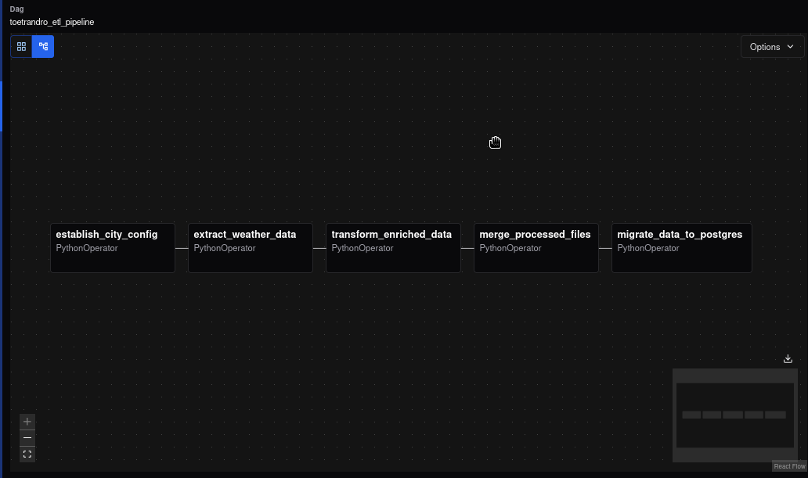

# ⚙️ Pipeline Documentation — Toetrandro ETL

This document provides a technical walkthrough of the ETL pipeline implemented in the `toetrandro-etl` project. 
The pipeline is orchestrated using Apache Airflow and is composed of five modular tasks, each implemented as a `PythonOperator`.

---

## 🧱 DAG Structure Overview

The pipeline is composed of the following sequential tasks:

```
city_config_task >> extract_task >> transform_task >> merge_task >> migration_task
```

Each task is responsible for a distinct phase in the ETL process.


---

## 🔹 1. city_config_task (PythonOperator)

**Purpose:**  
Initializes the configuration for each city to be processed in the pipeline.

**What it does:**

- Loads a predefined list of cities
- Associates each city with metadata (e.g., country, coordinates such as longitude and latitude)
- Stores the configuration in a format accessible to downstream tasks in [config.json](../../config/cities.json)

**Why it matters:**  
This task ensures that all subsequent steps operate on a consistent and validated set of cities.

---

## 🔹 2. extract_task (PythonOperator)

**Purpose:**  
Fetches real-time weather data for each configured city.

**What it does:**

- Calls the OpenWeather API using the city list from the previous task
- Retrieves current weather metrics (temperature, humidity, wind, etc.)
- Saves the raw data into the [data/raw](../../data/raw) directory as CSV

**Why it matters:**  
This task brings in the most up-to-date weather data, which is essential for generating accurate travel recommendations.

---

## 🔹 3. transform_task (PythonOperator)

**Purpose:**  
Cleans and enriches the raw weather data.

**What it does:**

- Parses and normalizes timestamps, units, and missing values
- Adds derived metrics such as:
  - `comfort_score` (based on temperature, humidity, wind)
  - `is_ideal_day` (boolean flag based on thresholds)
- Outputs cleaned data to [data/processed](../../data/processed)

**Why it matters:**  
This step transforms raw API responses into structured, analysis-ready datasets.

---

## 🔹 4. merge_task (PythonOperator)

**Purpose:**  
Combines real-time and historical weather data into a unified dataset.

**What it does:**

- Loads the latest processed data
- Merges it with historical records from [cleaned_historical_data.csv](../../data/historical/cleaned_historical_data.csv)
- Ensures no duplication and consistent schema
- Outputs the final dataset to [ready_data.csv](../../data/merged/ready_data.csv)

**Why it matters:**  
This task creates a complete time series dataset that powers the dashboard and downstream analytics.

---

## 🔹 5. migration_task (PythonOperator)

**Purpose:**  
Loads the merged dataset into a PostgreSQL database using a star schema.

**What it does:**

- Loads [ready_data.csv](../../data/merged/ready_data.csv) into a staging table
- Populates dimension tables:
  - `dim_city`
  - `dim_date`
  - `dim_weather`
- Inserts new records into the `weather_facts` fact table
- Uses `ON CONFLICT DO NOTHING` to avoid duplicates

**Why it matters:**  
This step makes the data queryable for dashboards and analytics tools like Metabase.

---

## 🧪 Testing & Monitoring

Each task is unit-tested and includes:

- Logging for traceability
- Retry logic for transient failures
- Mocking of external dependencies (e.g., API calls)

---

## 📌 Notes

- The pipeline is designed to be idempotent: re-running it for the same date will not duplicate data.
- All paths and credentials are managed via Airflow Variables and `.env` files for security and flexibility.

---

## 📎 Related Files

- [workflows/dags/toetrandro_etl.py](../../workflows/dags/toetrandro_etl.py) — DAG definition
- [workflows/scripts/](../../workflows/scripts/) — Task logic implementations
- [src/core/](../../src/core) — Data transformation and migration logic
- [data](../../data) — Input/output directories for each pipeline stage

---

## 🧠 Summary

This pipeline automates the full journey from raw weather data to actionable insights. Each task is modular, testable, and designed for reliability in production environments.
